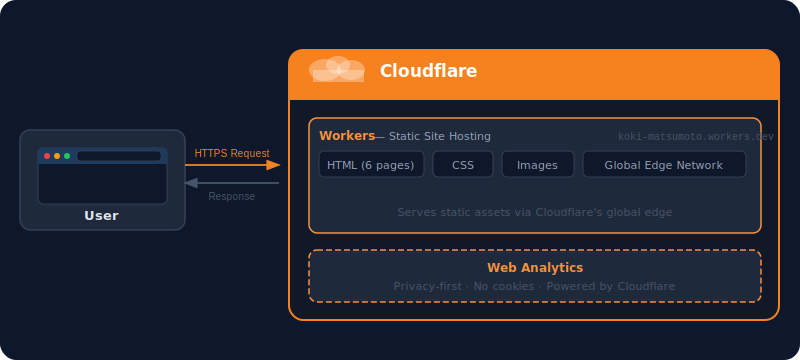

# Koki Matsumoto — Personal Website

Source code for the personal website of **Koki Matsumoto**, a Data Engineer based in Fukuoka, Japan.

**Live site:** https://www.koki-matsumoto.workers.dev/

---

## Pages

| Page | Path | Description |
|------|------|-------------|
| Profile | `/` | Career, skills, certifications, and community activities |
| Hobbies | `/hobbies.html` | Books, travel, drinks, exercise, and blog |
| Travel | `/travel.html` | Interactive world map of 12 visited countries |
| Wine | `/wine.html` | Tasting notes |
| Technical Books | `/books-technical.html` | Technical books with reviews |
| Classics | `/books-classics.html` | Classic literature with reviews |

---

## Architecture



The site is hosted on **Cloudflare Workers** as a static site. All HTML, CSS, and image assets are served directly from Cloudflare's global edge network, ensuring low latency worldwide. Access analytics are collected via **Cloudflare Web Analytics** — privacy-first and cookie-free.

---

## Tech Stack

| Category | Technology |
|----------|------------|
| **Frontend** | HTML, CSS (no framework) |
| **Hosting** | Cloudflare Workers (static assets) |
| **Analytics** | Cloudflare Web Analytics |
| **Icons** | Font Awesome 6, Devicon |
| **Fonts** | Google Fonts (Inter, JetBrains Mono) |
| **Map** | jsVectorMap |
| **Code Review** | CodeRabbit (AI-powered, automated) |
| **CI/CD** | GitHub Actions (auto-merge on approval) |

---

## Directory Structure

```
/
├── index.html              # Profile top page
├── hobbies.html            # Hobbies overview
├── travel.html             # Travel log with world map
├── wine.html               # Wine tasting notes
├── books-technical.html    # Technical book reviews
├── books-classics.html     # Classic literature reviews
│
├── css/
│   ├── style.css           # Global styles
│   ├── hobbies.css         # Hobbies page styles
│   └── travel.css          # Travel page styles
│
├── assets/
│   ├── profile.jpg         # Profile photo
│   ├── ogp.jpg             # OGP image (1200×630)
│   ├── book_de_basics.jpg  # Book cover image
│   ├── ogp-template.html   # OGP image generation template
│   └── architecture.svg    # Architecture diagram
│
├── scripts/
│   └── generate-ogp.mjs    # OGP image generation script
│
├── .github/
│   └── workflows/
│       └── auto-merge.yml  # Auto-merge on CodeRabbit approval
│
├── .coderabbit.yaml        # CodeRabbit configuration
└── wrangler.jsonc          # Cloudflare Workers configuration
```
