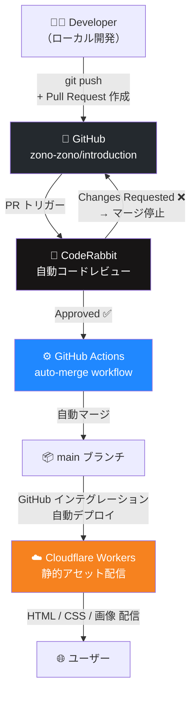
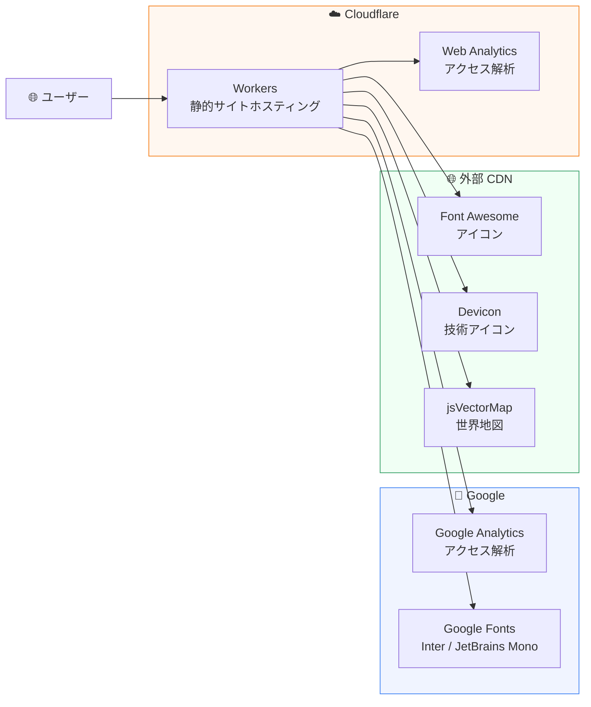

# Koki Matsumoto — Personal Website

福岡在住のデータエンジニア **Koki Matsumoto** の個人サイトのソースコードです。

**本番URL:** https://www.koki-matsumoto.workers.dev/

---

## サイト概要

| ページ | パス | 内容 |
|--------|------|------|
| プロフィール | `/` | 経歴・スキル・資格・コミュニティ活動 |
| 趣味 | `/hobbies.html` | 読書・旅行・お酒・運動・ブログ一覧 |
| 旅行 | `/travel.html` | 訪問12カ国のインタラクティブ世界地図 |
| ワイン | `/wine.html` | テイスティングノート |
| 技術書 | `/books-technical.html` | 読了技術書と感想 |
| 古典 | `/books-classics.html` | 読了古典と感想 |

---

## アーキテクチャ

### デプロイパイプライン



### 本番環境構成



---

## 技術スタック

| カテゴリ | 技術 |
|----------|------|
| **フロントエンド** | HTML, CSS（フレームワークなし） |
| **ホスティング** | Cloudflare Workers（静的アセット配信） |
| **アクセス解析** | Cloudflare Web Analytics, Google Analytics |
| **アイコン** | Font Awesome 6, Devicon |
| **フォント** | Google Fonts（Inter, JetBrains Mono） |
| **地図** | jsVectorMap |
| **コードレビュー** | CodeRabbit（AI自動レビュー） |
| **CI/CD** | GitHub Actions（auto-merge） |
| **OGP画像生成** | Playwright（Node.js） |

---

## ディレクトリ構成

```
/
├── index.html              # プロフィールトップ
├── hobbies.html            # 趣味一覧
├── travel.html             # 旅行記録（世界地図）
├── wine.html               # ワインテイスティングノート
├── books-technical.html    # 技術書レビュー
├── books-classics.html     # 古典レビュー
│
├── css/
│   ├── style.css           # 共通スタイル
│   ├── hobbies.css         # 趣味ページスタイル
│   └── travel.css          # 旅行ページスタイル
│
├── assets/
│   ├── profile.jpg         # プロフィール画像
│   ├── ogp.jpg             # OGP画像（1200×630）
│   ├── book_de_basics.jpg  # 書影
│   └── ogp-template.html   # OGP画像生成テンプレート
│
├── scripts/
│   └── generate-ogp.mjs    # OGP画像生成スクリプト
│
├── .github/
│   └── workflows/
│       └── auto-merge.yml  # CodeRabbit承認後の自動マージ
│
├── .coderabbit.yaml        # CodeRabbit設定
└── wrangler.jsonc          # Cloudflare Workers設定
```

